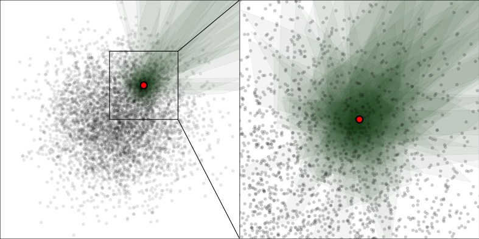

# MRPT - fast nearest neighbor search with random projection



[](http://vioshyvo.github.io/mrpt/html/index.html)

MRPT is a lightweight and easy-to-use library for approximate nearest neighbor search. It is written in C++11 and has Python bindings. The index building has an integrated hyperparameter tuning algorithm, so the only hyperparameter required to construct the index is the target recall level!

According to [our experiments](https://github.com/ejaasaari/mrpt-comparison/) MRPT is currently the *fastest* library to reach high recall levels for common data sets.

In the offline phase of the algorithm MRPT indexes the data with a collection of *random projection trees*. In the online phase the index structure allows us to answer queries in superior time. A detailed description of the algorithm with the time and space complexities, and the aforementioned comparisons can be found in [our article](https://www.cs.helsinki.fi/u/ttonteri/pub/bigdata2016.pdf) that was published in IEEE International Conference on Big Data 2016.

The tests for MRPT are in a separate [repo](https://github.com/vioshyvo/RP-test).
## New

- Release [MRPT 1.0.0](https://github.com/vioshyvo/mrpt/releases) (2018/11/22)

- Add [documentation](http://vioshyvo.github.io/mrpt/html/index.html) for C++ API (2018/11/22)

- Add index building with autotuning: no more manual hyperparameter tuning! (2018/11/21)

## Python installation

Install the module with `pip install git+https://github.com/vioshyvo/mrpt/`

On MacOS, LLVM is needed for compiling: `brew install llvm libomp`

## Minimal examples

### Python

This example first generates a 200-dimensional data set of 10000 points, and 100 test query points. The `exact_search` function can be used to find the indices of the true 10 nearest neighbors of the first test query.

The `build_autotune` function then builds an index for approximate k-nn search; it uses automatic parameter tuning, so only the target recall level (90% in this example), the set of test queries and the number of neighbors searched for have to be specified. According to our experiments a test set of 100 queries is sufficient to find the optimal parameters. Using more test queries increases the accuracy of the estimates of query time and recall, but slows the autotuning.

```python
import mrpt
import numpy as np

n, n_test, d, k = 10000, 100, 200, 10
target_recall = 0.9

data = np.random.rand(n, d).astype(np.float32)
test = np.random.rand(n_test, d).astype(np.float32)

index = mrpt.MRPTIndex(data)
print(index.exact_search(test[0], k))

index.build_autotune(target_recall, test, k)
print(index.ann(test[0], return_distances=False))
```

The approximate nearest neighbors are then searched by the function `ann`; because the index was autotuned, no other arguments than the query point are required.

Here is a sample output:
```
[7802 9451 3454 4851 8643 3491 1121 1879 6609 4385]
[7802 9451 3454 4851 8643 3491 1121 6609 8249 6949]
```

### C++

MRPT is a header-only library, so no compilation is required: just include the header `cpp/Mrpt.h`. The only dependency is the Eigen linear algebra library (Eigen 3.3.5 is bundled in `cpp/lib`), so when using g++, the following minimal example can be compiled for example as:
```
g++ -std=c++11 -Ofast -march=native -Icpp -Icpp/lib ex1.cpp -o ex1 -fopenmp -lgomp
```

Let's first generate a 200-dimensional data set of 10000 points, and a query point (row = dimension, column = data point). Then `Mrpt::exact_knn` can be used to find the indices of the true 10 nearest neighbors of the test query.

The `grow_autotune` function builds an index for approximate k-nn search; it uses automatic parameter tuning, so only the target recall level (90% in this example), and the number of neighbors searched for have to be specified. This version automatically samples a test set of 100 query points from the data set to tune the parameters, so no separate test set is required.

```c++
#include <iostream>
#include "Eigen/Dense"
#include "Mrpt.h"

int main() {
  int n = 10000, d = 200, k = 10;
  double target_recall = 0.9;
  Eigen::MatrixXf X = Eigen::MatrixXf::Random(d, n);
  Eigen::MatrixXf q = Eigen::VectorXf::Random(d);

  Eigen::VectorXi indices(k), indices_exact(k);

  Mrpt::exact_knn(q, X, k, indices_exact.data());
  std::cout << indices_exact.transpose() << std::endl;

  Mrpt mrpt(X);
  mrpt.grow_autotune(target_recall, k);

  mrpt.query(q, indices.data());
  std::cout << indices.transpose() << std::endl;
}
```

The approximate nearest neighbors are then searched by the function `query`; because the index was autotuned, no other arguments than a query point and an output buffer for indices are required.

Here is a sample output:
```
8108 1465 6963 2165   83 5900  662 8112 3592 5505
8108 1465 6963 2165   83 5900 8112 3592 5505 7992
```
The approximate nearest neighbor search found 9 of 10 true nearest neighbors; so this time the observed recall happened to match the expected recall exactly (results vary between the runs because the algorithm is randomized).

## Citation
~~~~
@inproceedings{Hyvonen2016,
  title={Fast nearest neighbor search through sparse random projections and voting},
  author={Hyv{\"o}nen, Ville and Pitk{\"a}nen, Teemu and Tasoulis, Sotiris and J{\"a}{\"a}saari, Elias and Tuomainen, Risto and Wang, Liang and Corander, Jukka and Roos, Teemu},
  booktitle={Big Data (Big Data), 2016 IEEE International Conference on},
  pages={881--888},
  year={2016},
  organization={IEEE}
}
~~~~


## MRPT for other languages

- [Go](https://github.com/rikonor/go-ann)

## License

MRPT is available under the MIT License (see [LICENSE.txt](LICENSE.txt)). Note that third-party libraries in the cpp/lib folder may be distributed under other open source licenses. The Eigen library is licensed under the MPL2.
